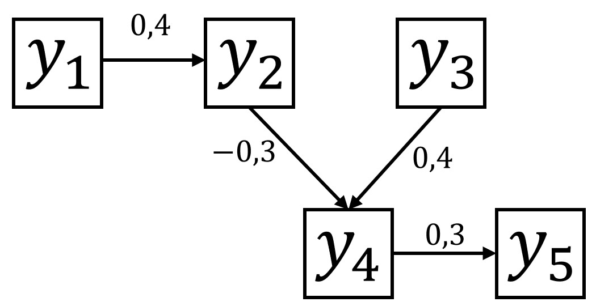

# SEM_popsim

## Population simulator with phenotypic recursive effects

### Considerations

The code is free to use and modification, parameters loaded by default are used by the authors.

In case of use for research, please cite us.

*THERE IS NO WARRANTY THAT THE PROGRAM IS ERROR FREE. COMMENTS ARE WELCOME.*

The code simulate the following causal network, path coefficients are easy to change, for different causal networks major modifications are required, including tables and dataframes.

### Use of BLUPF90
During simulations RENUMF90 and BLUPF90 executables are required (Animal breeding and genetic group, University of Georgia).   
Can be downloaded from http://nce.ads.uga.edu/html/projects/programs/.  
The files names mut be:
- `renumf90.exe` and `blupf90.exe` if you run in windows
- `renumf90` and `blupf90` if you run in linux
  
Parameter files are used in simulation:  
- `RENUMF90_for_diagonal.par` for diagonal covariances  
- `RENUMF90_for_nodiagonal.par` for no diagonal covariances
  
Code available:  
- `SEM-Sim.single - Windows.R` for simulation a single replicate with a known simulation seed using windows store values for single individuals

## User customization - Single replicate

**If you are running on Linux system make the following changes**
In section `RUN RENUMF90 AND BLUPF90` in *lines 518 - 519; lines 714 - 715; lines 802 - 803 and lines 1006 - 1007*:    
- Replace `system(command = "renumf90.exe", input = MTM.par)` by `system(command = "./renumf90", input = MTM.par)` 
- Replace `system(command = "blupf90.exe", input = MTM.par)` by `system(command = "echo renf90.par | ./blupf90")`

L50: Define working directory, BLUPF90 executables and files must be in this folder.

L53: Define storage directory. Output files will be saved in this folder.

L56: Parameter file for RENUMF90 used for MTM

L60: Parameter file for RENUMF90 for equivalent MTM for SEM estimations

*Parameter files could be the same if the variance parameters are the same between models.*  
*If you want to use estimated parameters these parameters could be different (by error of estimation).*

L67: Simulation seed.

L72 to L80: Population structure. $NVAC$x$PREPOSH$ and $NTOR$x$PREPOSM$ must be integer.

L86: S2U: Additive covariance structure for simulation in matrix format.

L94: S2E: Residual covariance structure for simmulation in matrix format

L102: LAMBDA: Causal structure for simulation in matrix format. For non reciprocal relations the matrix resultant is lower diagonal. Read as row is caused by column.

L128: LAMBDA.e: Causal structure for estimation in matrix format. Used for backsolving EBVs, if the process is executed with all known parameters $LAMBDA=LAMBDA.e$.

*After run BLOCK I the matrix for the equivalent model are printed in the console, if you are running the estimations using known parameters these matrix must be used for BLUPF90. Check in RENUMF90 parameter files.*

L547; L584; L838; L876: in `slice_max(EBV#` state the EBV used for selection in format "`EBV#`" (i.e. EBV1, EBV2, ....., EBV5)
